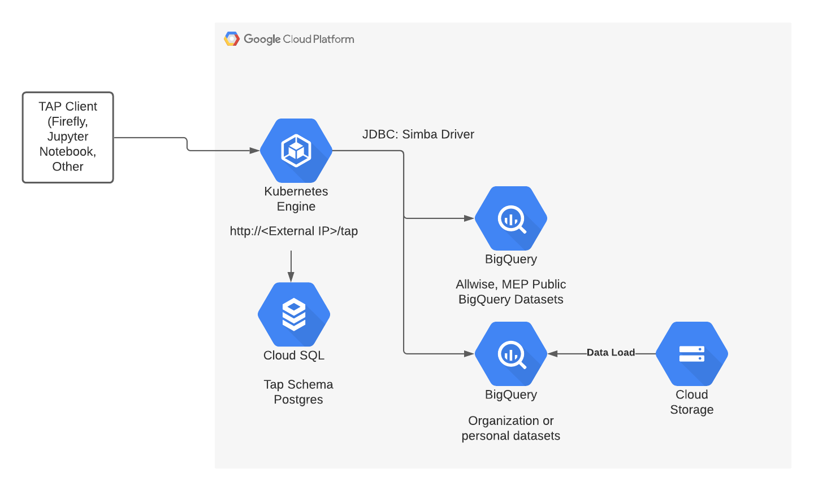

# Example BigQuery TAP service

This is a sample TAP service implementation to deploy TAP on Google Kubernetes Engine to query astronomy datasets stored on Google Cloud BigQuery. BigQuery supports queries on spherical geometry using [BigQuery GIS](https://cloud.google.com/bigquery/docs/geospatial-intro).   The sample is connected to the WISE and MEP Astronomy BigQuery BigQuery Public Datasets.  If you have your own datasets can be loaded into BigQuery.

## TAP Installation

The script assumes you have a default network created.  If an organization policy is in place preventing automatic creation of default networks.  Please create a VPC named default or later specify a the network flag on the GKE install for the appropriate network.

Perform the following steps to install the TAP Service.

* Create a GCP Project and assign a billing account
* [Install the Google Cloud SDK](https://cloud.google.com/sdk/docs/install)
* Run `gcloud auth login` to login and `gcloud config set project <project-id>` to set the project ID for your project.  
* Edit the variables in the (tap-install.sh)[tap-install.sh] file in this directory.  Update the variables in the beginning with the GCP Project ID and the GCP region name you would like to install TAP.  Run `./tap-install.sh` to install.  The installation will take around 5 to 10 minutes to complete. 
* Once complete run kubectl get svc to see status of provisioning of external IP. 

## Querying Data

Common Astronomy tools like Firefly, Stilts, Python's pvyo were all tested.  For accessing obtain the IP Address used by TAP.  Run `kubectl get svc` to obtain the IP Address used by the tap service.  The URL is `http://<external-ip>/tap`.  Certificates can be added and a DNS name for a production deployment.

Below is a sample query using stilts. Replace with the external IP of the TAP Serivce.

`java -jar stilts.jar tapquery tapurl="http://<external-ip>/tap" adql="SELECT COUNT(*) FROM tapdata.allwise WHERE 1=CONTAINS(POINT('ICRS',ra,dec),POLYGON('ICRS',24.2627228,-23.1891824,26,-24,0,0))"`

## Data Load

Data loading through the the TAP interface was not developed for this iteration.  BigQuery supports data loading directly and is very performant because the load is automatically paralleizing into BigQuery.  BigQuery supports loading files in Avro, CSV, JSON, ORC, or Parquet format.  [Here](https://cloud.google.com/bigquery/docs/loading-data) is an overview of loading data into BigQuery.

## SQL Queries with BigQuery

This data can also be directly queried in BigQuery using standard SQL.  [Here](https://cloud.google.com/blog/products/data-analytics/querying-the-stars-with-bigquery-gis) is supporting GCP blog post 
that discusses querying this data directly in BigQuery

Contact [dspeck@burwood.com](mailto:dspeck@burwood.com) if you need help.

